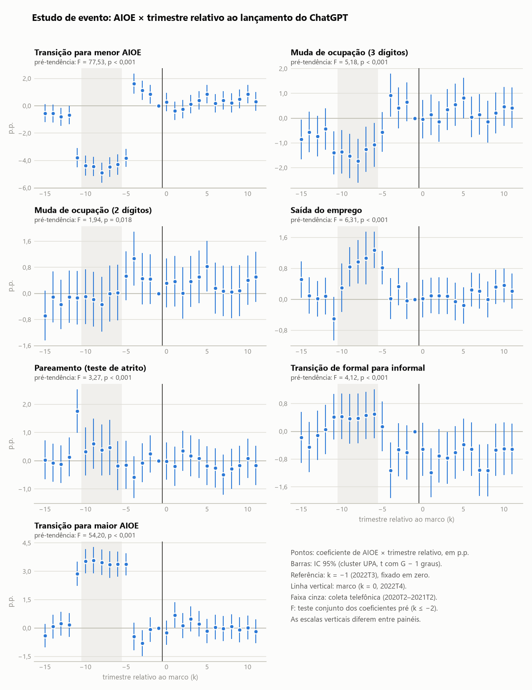

# Robustezes do resultado principal

Gerado por `scripts/07_robustez.py` em 2026-09-11. Revisão interna:
nada aqui foi levado à dissertação.

- Base: o mesmo CSV da etapa 05 (SHA-256 `c178ad5f6cd8…`, conferido contra os metadados da Tabela 4).
- Motor: pyfixest 0.60.0, mesmos pesos (`peso_total`) e mesmos efeitos fixos da Tabela 4.
- Inferência conservadora como na Tabela 4: t com G − 1 graus de liberdade, G = número de clusters
  efetivamente usados (no agrupamento em duas vias, o menor dos dois).
- Coeficientes e EP em pontos percentuais. **Variação da magnitude** = |β robustez| / |β Tabela 4| − 1.
- **Reprodução da Tabela 4** dentro desta etapa (mesma especificação, cluster UPA): maior diferença
  de coeficiente 1,2e−10 p.p. e de EP 6,7e−09 p.p.;
  número de clusters idêntico em todos os desfechos: sim.

## (a) Sem coleta telefônica atípica

Exclui os trimestres de origem 2020T2 a 2021T2 (5
trimestres), marcados por `coleta_atipica` na etapa 04. Mesma especificação, cluster UPA.

| Desfecho | Coef. baseline (p.p.) | Coef. robustez (p.p.) | EP (p.p.) | IC 95% | p-valor | N | Clusters | Variação da magnitude |
| --- | ---: | ---: | ---: | --- | ---: | ---: | ---: | ---: |
| Transição para menor AIOE | +2,187 | +0,969 | 0,111 | [+0,752; +1,187] | <0,001 | 2.503.704 | 30.874 | −55,7% |
| Muda de ocupação (3 dígitos) | +0,861 | +0,530 | 0,146 | [+0,245; +0,815] | <0,001 | 2.506.568 | 30.874 | −38,4% |
| Muda de ocupação (2 dígitos) | +0,278 | +0,221 | 0,138 | [−0,049; +0,491] | 0,108 | 2.506.568 | 30.874 | −20,4% |
| Saída do emprego | −0,250 | −0,003 | 0,080 | [−0,160; +0,154] | 0,972 | 2.778.537 | 30.888 | −98,9% |
| Pareamento (teste de atrito) | −0,261 | −0,204 | 0,139 | [−0,477; +0,068] | 0,141 | 3.472.881 | 30.992 | −21,6% |
| Transição de formal para informal | −0,673 | −0,466 | 0,104 | [−0,669; −0,262] | <0,001 | 1.462.412 | 30.173 | −30,8% |
| Transição para maior AIOE | −1,364 | −0,397 | 0,110 | [−0,613; −0,181] | <0,001 | 2.503.704 | 30.874 | −70,9% |

## (b) Inferência

Mesmo ajuste da Tabela 4; muda só o agrupamento dos erros-padrão. O coeficiente é idêntico por
construção, então a variação da magnitude é zero e o que importa são EP, IC e p-valor.

### (b1) Cluster na ocupação de origem

| Desfecho | Coef. baseline (p.p.) | Coef. robustez (p.p.) | EP (p.p.) | IC 95% | p-valor | N | Clusters | Variação da magnitude |
| --- | ---: | ---: | ---: | --- | ---: | ---: | ---: | ---: |
| Transição para menor AIOE | +2,187 | +2,187 | 0,363 | [+1,473; +2,902] | <0,001 | 2.876.964 | 412 | +0,0% |
| Muda de ocupação (3 dígitos) | +0,861 | +0,861 | 0,458 | [−0,040; +1,761] | 0,061 | 2.880.049 | 412 | +0,0% |
| Muda de ocupação (2 dígitos) | +0,278 | +0,278 | 0,465 | [−0,637; +1,192] | 0,551 | 2.880.049 | 412 | +0,0% |
| Saída do emprego | −0,250 | −0,250 | 0,170 | [−0,584; +0,083] | 0,140 | 3.176.283 | 412 | +0,0% |
| Pareamento (teste de atrito) | −0,261 | −0,261 | 0,139 | [−0,534; +0,013] | 0,062 | 3.960.584 | 412 | −0,0% |
| Transição de formal para informal | −0,673 | −0,673 | 0,365 | [−1,391; +0,044] | 0,066 | 1.676.862 | 410 | +0,0% |
| Transição para maior AIOE | −1,364 | −1,364 | 0,483 | [−2,312; −0,415] | 0,005 | 2.876.964 | 412 | −0,0% |

### (b2) Cluster em duas vias: ocupação e UPA

| Desfecho | Coef. baseline (p.p.) | Coef. robustez (p.p.) | EP (p.p.) | IC 95% | p-valor | N | Clusters | Variação da magnitude |
| --- | ---: | ---: | ---: | --- | ---: | ---: | ---: | ---: |
| Transição para menor AIOE | +2,187 | +2,187 | 0,364 | [+1,472; +2,903] | <0,001 | 2.876.964 | 412 | +0,0% |
| Muda de ocupação (3 dígitos) | +0,861 | +0,861 | 0,460 | [−0,043; +1,764] | 0,062 | 2.880.049 | 412 | +0,0% |
| Muda de ocupação (2 dígitos) | +0,278 | +0,278 | 0,466 | [−0,639; +1,194] | 0,552 | 2.880.049 | 412 | +0,0% |
| Saída do emprego | −0,250 | −0,250 | 0,170 | [−0,585; +0,084] | 0,142 | 3.176.283 | 412 | +0,0% |
| Pareamento (teste de atrito) | −0,261 | −0,261 | 0,154 | [−0,564; +0,043] | 0,092 | 3.960.584 | 412 | −0,0% |
| Transição de formal para informal | −0,673 | −0,673 | 0,365 | [−1,391; +0,044] | 0,066 | 1.676.862 | 410 | +0,0% |
| Transição para maior AIOE | −1,364 | −1,364 | 0,483 | [−2,314; −0,413] | 0,005 | 2.876.964 | 412 | −0,0% |

### (b3) Correção para multiplicidade

Família: os sete desfechos, para o termo AIOE × pós. Holm controla a taxa de erro por família;
Benjamini-Hochberg (BH), a taxa de falsas descobertas. O pareamento é um teste de atrito, e mantê-lo
na família torna a correção mais conservadora, não menos.

| Desfecho | p (UPA) | Holm | BH | p (ocupação) | Holm | BH | p (ocupação e UPA) | Holm | BH |
| --- | ---: | ---: | ---: | ---: | ---: | ---: | ---: | ---: | ---: |
| Transição para menor AIOE | <0,001 | <0,001 | <0,001 | <0,001 | <0,001 | <0,001 | <0,001 | <0,001 | <0,001 |
| Muda de ocupação (3 dígitos) | <0,001 | <0,001 | <0,001 | 0,061 | 0,305 | 0,092 | 0,062 | 0,309 | 0,115 |
| Muda de ocupação (2 dígitos) | 0,030 | 0,060 | 0,035 | 0,551 | 0,551 | 0,551 | 0,552 | 0,552 | 0,552 |
| Saída do emprego | <0,001 | 0,003 | 0,001 | 0,140 | 0,305 | 0,164 | 0,142 | 0,309 | 0,166 |
| Pareamento (teste de atrito) | 0,064 | 0,064 | 0,064 | 0,062 | 0,305 | 0,092 | 0,092 | 0,309 | 0,129 |
| Transição de formal para informal | <0,001 | <0,001 | <0,001 | 0,066 | 0,305 | 0,092 | 0,066 | 0,309 | 0,115 |
| Transição para maior AIOE | <0,001 | <0,001 | <0,001 | 0,005 | 0,030 | 0,017 | 0,005 | 0,030 | 0,018 |

## (c) Estudo de evento

A interação única AIOE × pós vira uma interação por trimestre relativo ao marco, com referência em
k = −1 (2022T3); a teletrabalhabilidade é interagida da mesma forma. Cluster UPA.

A coluna **coef. robustez** é a média simples dos coeficientes pós (k ≥ 0, 2022T4 em diante),
medida contra k = −1. Não é o mesmo estimando da Tabela 4, que compara o pós com a média de todo o
pré: se houver tendência no pré, as duas divergem, e a divergência é informativa em si.

| Desfecho | Coef. baseline (p.p.) | Coef. robustez (p.p.) | EP (p.p.) | IC 95% | p-valor | N | Clusters | Variação da magnitude |
| --- | ---: | ---: | ---: | --- | ---: | ---: | ---: | ---: |
| Transição para menor AIOE | +2,187 | +0,293 | 0,260 | [−0,216; +0,803] | 0,259 | 2.876.964 | 31.036 | −86,6% |
| Muda de ocupação (3 dígitos) | +0,861 | +0,235 | 0,316 | [−0,385; +0,855] | 0,458 | 2.880.049 | 31.036 | −72,7% |
| Muda de ocupação (2 dígitos) | +0,278 | +0,309 | 0,295 | [−0,270; +0,887] | 0,296 | 2.880.049 | 31.036 | +11,0% |
| Saída do emprego | −0,250 | +0,121 | 0,174 | [−0,219; +0,462] | 0,485 | 3.176.283 | 31.047 | −51,6% (sinal invertido) |
| Pareamento (teste de atrito) | −0,261 | −0,087 | 0,274 | [−0,623; +0,450] | 0,751 | 3.960.584 | 31.145 | −66,7% |
| Transição de formal para informal | −0,673 | −0,704 | 0,304 | [−1,300; −0,108] | 0,021 | 1.676.862 | 30.360 | +4,6% |
| Transição para maior AIOE | −1,364 | +0,081 | 0,249 | [−0,408; +0,570] | 0,744 | 2.876.964 | 31.036 | −94,0% (sinal invertido) |

### Pré-tendências

Teste F conjunto de que todos os coeficientes pré (k ≤ −2) são zero.

| Desfecho | F | gl | p-valor |
| --- | ---: | ---: | ---: |
| Transição para menor AIOE | 77,53 | 14 | <0,001 |
| Muda de ocupação (3 dígitos) | 5,18 | 14 | <0,001 |
| Muda de ocupação (2 dígitos) | 1,94 | 14 | 0,018 |
| Saída do emprego | 6,31 | 14 | <0,001 |
| Pareamento (teste de atrito) | 3,27 | 14 | <0,001 |
| Transição de formal para informal | 4,12 | 14 | <0,001 |
| Transição para maior AIOE | 54,20 | 14 | <0,001 |

## Arquivos

- `a_sem_coleta_atipica.csv`, `b1_cluster_ocupacao.csv`, `b2_cluster_ocupacao_upa.csv`,
  `c_estudo_evento_media_pos.csv` — as tabelas comparativas acima, em formato de dados.
- `b3_multiplicidade.csv` — p-valores brutos e ajustados.
- `c_estudo_evento_coeficientes.csv` — os coeficientes por trimestre (a tabela por trás da figura).
- `c_estudo_evento_pretendencia.csv` — o teste conjunto do pré.
- `fig_estudo_evento.pdf` / `.png`.
